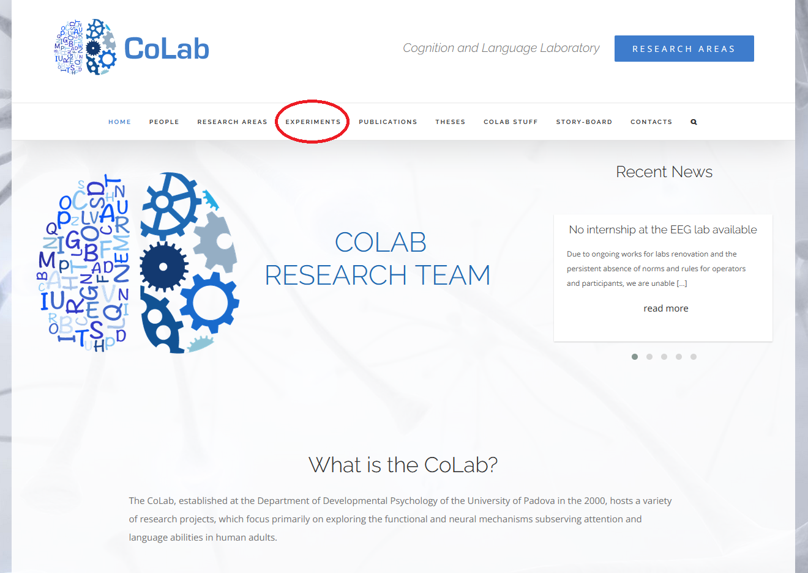
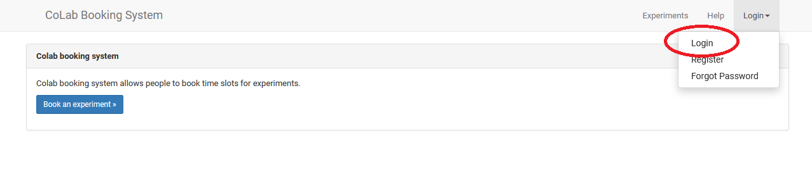
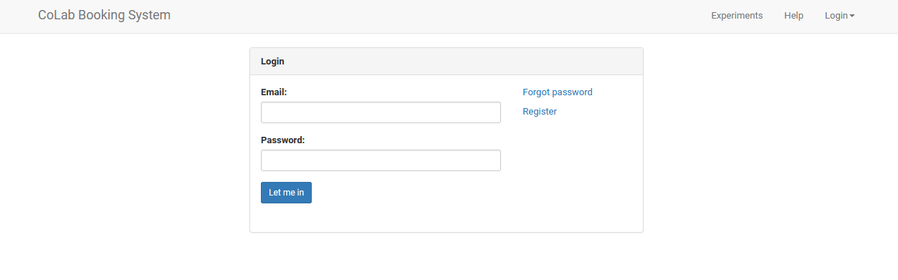
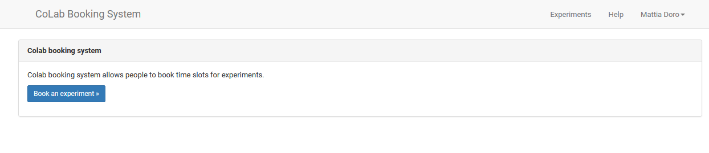
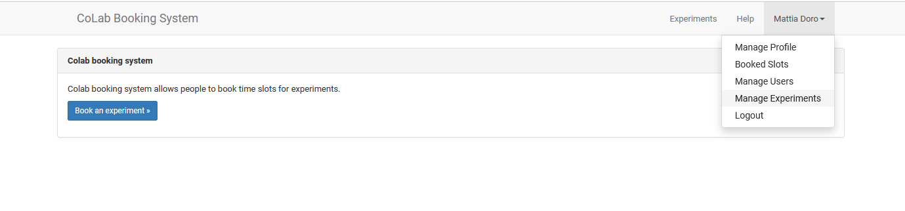
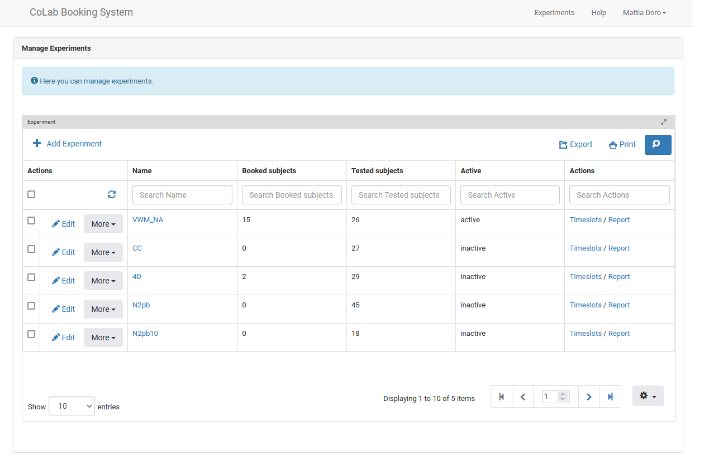
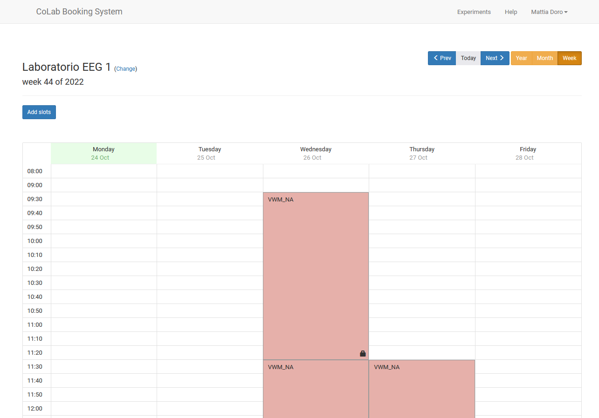

# -- UNDER CONSTRUCTION --

### Table of contents 

1. [Login](#login)

2. [Manage experiments](#manageexp)

3. [Managing slots](#manageslots)

### Login  
First, go on the [homepage](http://colab.psy.unipd.it/) of CoLab website. Click on "Experiment" 

Then click the Login button (upper right part of the page), and then click "Login" again.

You will land on this login page. 
Given that an experiment can have an unique administrator, we all could login using my account.
The email is: mattia.doro@gmail.com (I will provide you the password privately).

Once you are logged in, you will see my name in the upper right part of the page.

### Manage experiments 
###### [(Back to top)](#toc)

By clicking on my name and then the on "Manage experiments" you can see all the experiment that I posted (both in past and presently).

As you can see in the image below, only an experiment is currently active. This means that it is the only experiment visible to participants. If you click on the experiment's name, you can see all the experiment's setting (you will probably do need to edit anything)

### Managing slots 
###### [(Back to top)](#toc)

By clicking the 'Timeslot' button, you can see all the time slots in which participants can make their reservation, and add new time slots as well. The default view is on monthly basis, I suggest using the weekly basis view by clicking the 'Week' button on the upper right portion of the page.

