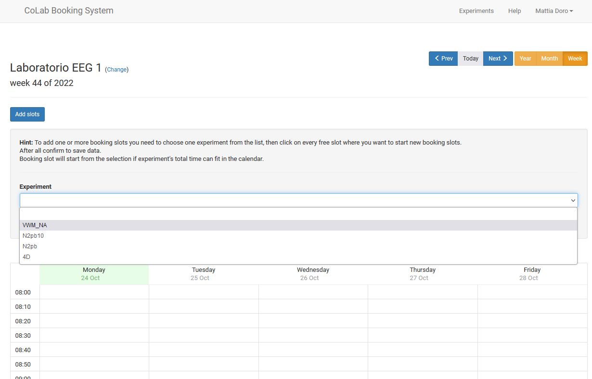
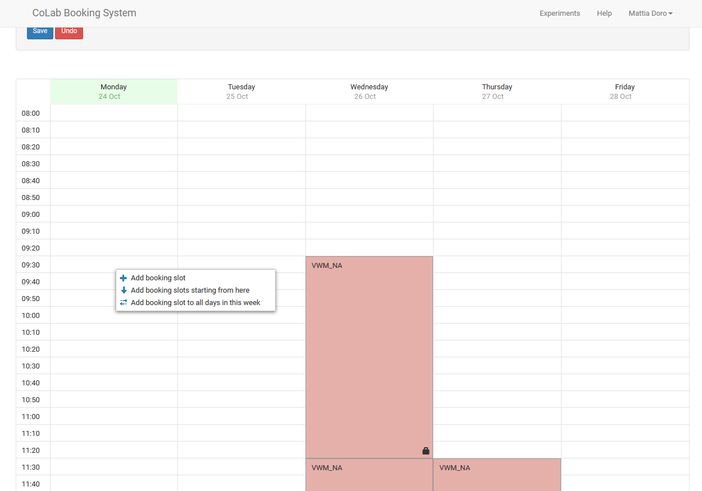
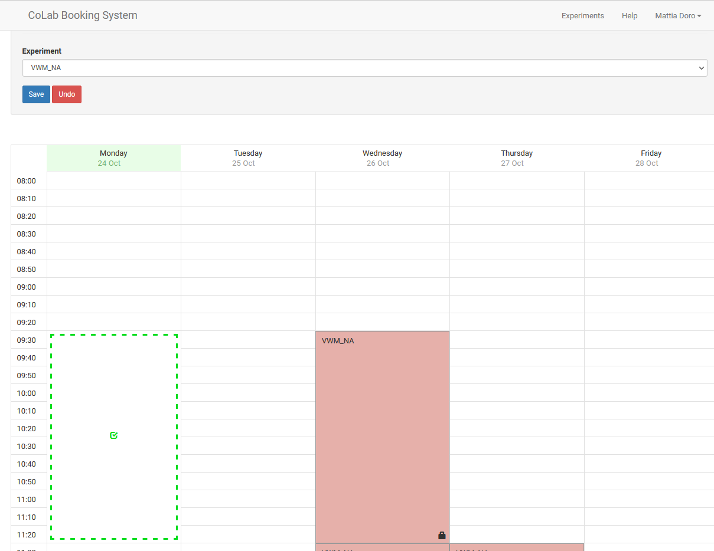
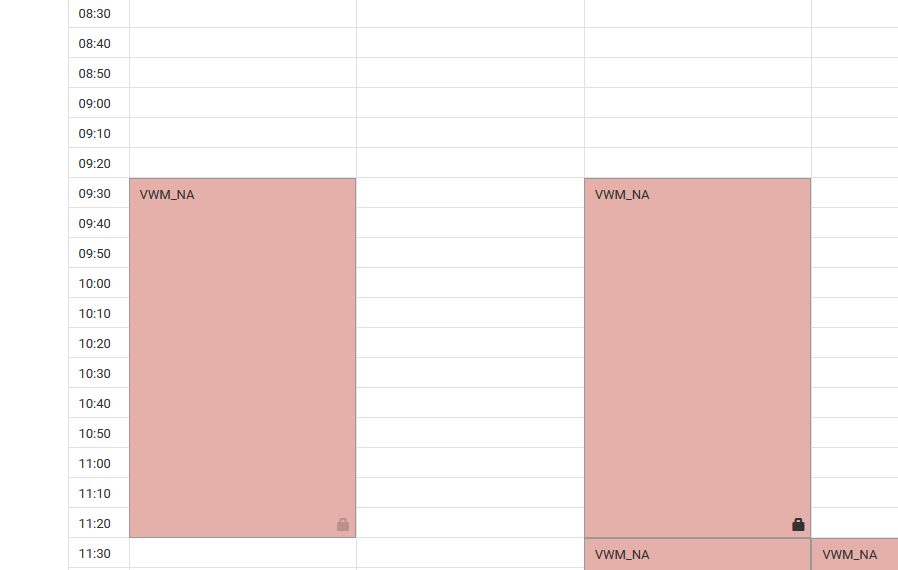
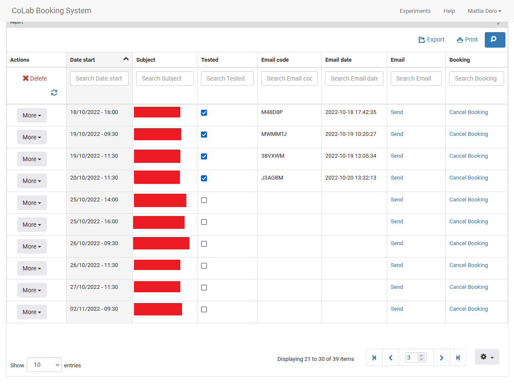

# -- UNDER CONSTRUCTION --

### Table of contents 

1. [Login](#login)

2. [Manage experiments](#manageexp)

3. [Managing slots](#manageslots)

4. [Experiment report](#report)

### Login  
First, go on the [homepage](http://colab.psy.unipd.it/) of CoLab website. Click on "Experiment" 

Then click the Login button (upper right part of the page), and then click "Login" again.

You will land on this login page. 
Given that an experiment can have an unique administrator, we all could login using my account.
The email is: mattia.doro@gmail.com (I will provide you the password privately).

Once you are logged in, you will see my name in the upper right part of the page.

### Manage experiments 
###### [(Back to top)](#toc)

By clicking on my name and then the on "Manage experiments" you can see all the experiment that I posted (both in past and presently).

As you can see in the image below, only an experiment is currently active. This means that it is the only experiment visible to participants. If you click on the experiment's name, you can see all the experiment's setting (you will probably do need to edit anything)

### Managing slots 
###### [(Back to top)](#toc)

By clicking the 'Timeslot' button, you can see all the time slots in which participants can make their reservation, and add new time slots as well. The default view is on monthly basis, I suggest using the weekly basis' view by clicking the 'Week' button on the upper right portion of the page.

Now, click on the 'Add slots' button, and then select the experiment. In this example, assume that we want to add a time slots for the experiment called 'VWM_NA'.

Click on the day and time you want the experiment must start, in this case, I clicked on Monday 24th, 9:30 am. Now click 'Add booking slot' choice.

A provisional slot will appear depicted in green. Once you finished inserting slots, you just need to click on the 'Save' button in the upper left portion of the page.

The time slot is inserted correctly. As you can see, this new time slot has a grey lock, while the other slot on right has a black lock. This means that the first slot has no reservation, while the second already has a participants scheduled. If you click on a slot you can remove it (but be careful and check first if someone booked on that slot, because you should email them first!).

### Experiment report 
###### [(Back to top)](#toc)

To see all the reservations in detail, go back to the experiment page (click 'Mattia Doro', then 'Manage Experiments').
Now click on the 'Report' of the experiment you want information about.

The page where you land will show all our appoinments (both past and future, here I hidden the subjects' names).
Once we finish testing a participant, we mark the 'Tested' information, and then we click on 'Send'. This last command will send to the participants an email that confirm their own participation to the experiment (this is useful when participants must take part to an experiment for some reason and they need a certification).
If you click on 'Cancel Booking' you will delete the reservation. Note that once you do this, you can retreive the participant's name (so be careful). Usually, if we cannot test a participant we email him/her before.

