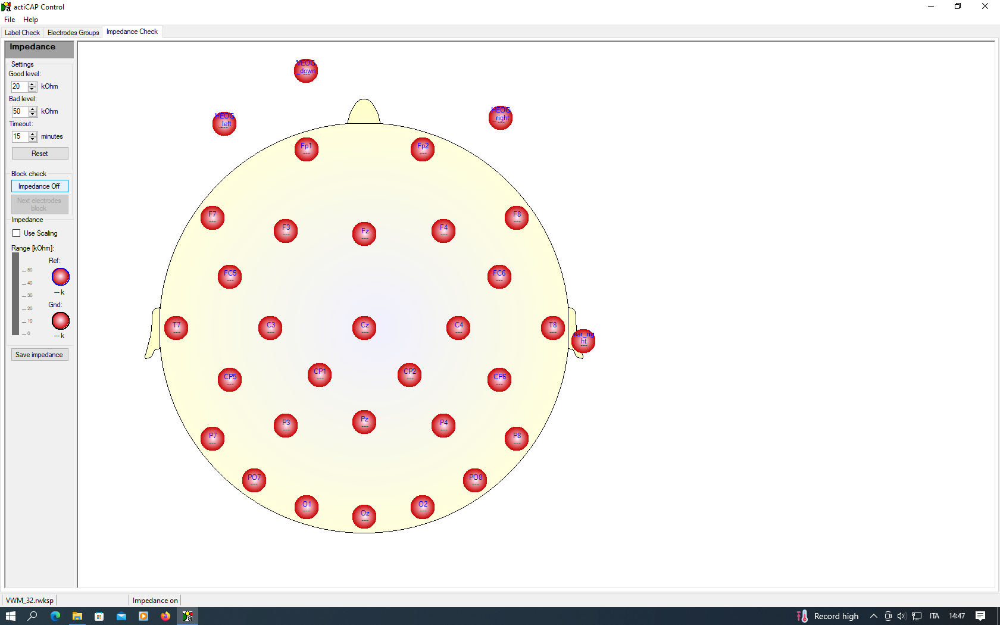

# Laboratory

### Table of contents 

1. [Preparing the lab](#preparing)

2. [Montage](#montage)

3. [Set the hardware connections](#hardware)

4. [Softwares](#softwares)

### Preparing the lab 
###### [(Back to top)](#toc)

- Behind the lab's door you find this switch. You can turn to the red size to turn on the "Laboratory in use" indication outside the lab (hoping that nobity will bother you during testing).

{width=40%}

- fill two syringes (about a half) with SuperVisc gel without the needles (we usually put the needle in front of the participant to prove that we use them only once). We usually cover the syringes with some paper to avoid participants' anxious reactions.
- put a bit of Nuprep (scrub) gel inside the green cup.
- put the informed consent and a pen on the desk where participant will perform the experiment.
- take the electrodes (reference and ground also) and put the adhesive discs where necessary.
- Be sure that you have all the necessary to do the montage (e.g., where is the measuring tape?).
- Put some paper towel/blotting paper or something similar on the sink that participant will use after the experiment to clean the gel.

### Montage 
###### [(Back to top)](#toc)

- Scrub below the left eye, near to the external canthi considering that the electrodes will be placed aligned to the pupils.
- Scrub the earlobes.
- Put the cap.
- Move the hair with the needle, put some gel, and then move the hair again if necessary. Remember that we say to participants that we are only moving the hair, but we are also doing a little scrub with the needle (that is necessary to reduce impedence).
- Put the scalp electrodes first, and then the external ones (eyes' and earlobes' electrodes).

### Set the hardware connections 
###### [(Back to top)](#toc)

- Unplug the battery by unplagging the blue plug on the top (it can only give electricity to amplifiers if it is not charging). 

{width=40%}

- Turn on the amplifiers with the switches behind them.

{width=40%}

- Plug the electrodes to the control box (see picture below). If you are doing a 32 channels montage plug them to the green slot, if you are doing a 64 channels you should plugged the first 32 electrodes (placed in the green placeholders of the cap) in the green slot, and the other 32 electrodes (yellow placeholders) in the yellow slot.

The right way to plug them is to match the triangle on the plug with the triangle on the slot (see picture below). Softly push the plug to insert in.

{width=40%}

Now, plug the Ref (Reference) and Gnd (Ground) electrode to their respective slot. There is a small cut on both the plugs that will help you to insert them in the right way.

{width=40%}

The stanby button on the control box should be already turned on. Otherwise, turn it on by pressing it few seconds.

### Softwares 
###### [(Back to top)](#toc)

#### Impedence check

- Open the Acticap Control software.

- Click on File, then on Load Recorder Workspace. Now you can choose a workspace in the folder in the experiment's folder, that is located in C:\\Vision\\Mattia\\[experiment name] (see [Studies](studies/studies.html)), it should be the only loadable file (anyway, the file extension is .rwksp).

- Now you have to change the channel definition (i.e., moving from the workspace the electrodes that are not on the scalp to their own place). Click on File, then on Load Channel Definition, go to the experiment folder and then click on the channel definition file (the file extension is .acdf).

- Move now to the tab called "Impedence Check" at the top part of the screen, and then click on "Impedence on" (left portion of the screen).

Now the electrodes (both on the screen and on the cap) will be red, yellow or green. This color give you information about the <abbr title="Roughly, impedence is the opposition to the electricity passage (from the scalp to the electrode).">impedence</abbr> of each electrode, although you can see the actual impedence value in k$\Omega$ (kilo ohm). By setting the "Good" and "Red" values you can change the threshold for which the electrode color change. Approximately, "Good" level can be set at 20 k$\Omega$ and "Bad" level at 50 k$\Omega$.

If all the electrodes are red, it means that the Reference's (Ref, blue electrode on left ear lobe) and/or the Ground's (Gnd, black electrode in the frontal portion of the cap) impedence is too high, and you should try to fix them at first. Given that the signal of all the other electrodes depend on them two, I would be correct to decrease their impedence as most as possible. Note that these two electrodes are represented on the left part of the window.

Once Reference and Ground impedences are fixed, all the other electrodes will start to change their color. Now it is time to fix them (if necessary). Sometimes the impedence is high not because of a lack of skin abrasion with the needle, but -possibly- because the cap cannot adhere properly on the head. In this case sometimes there is no solution, so in few cases we should be accept a montage which is not the best of the life. 

- Once you finish the montage, you can click on "Impedence off" in the left part of the window.

#### Recording

- Open Brain Vision Recorder software.

- Click on File, then on "Open Workspace". Choose now the workspace, that is located in C:\\Vision\\Mattia\\[experiment name] (see [Studies](studies/studies.html)) (extension: .rwksp). Differently from Acticap Control software for impedence check, you do not need to load a channel definition now. 

