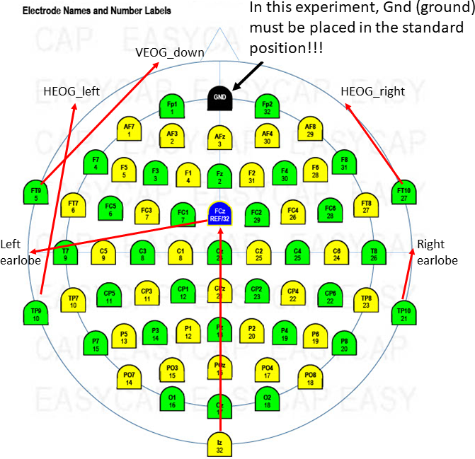

# Independent component analysis - Ocular correction

Experiment folder: C:\\Vision\\Mattia\\ICA

{width=80%}

Custom electrodes

- 5   -> VEOG_down

- 10  -> HEOG_left

- 27 -> HEOG_right

- 21 -> ear_right

- 32 -> FCz (blue placeholder)

- Ref -> ear_left

- Gnd -> STANDARD POSITION! (i.e., black placeholder)

## Run the experiment
To run the experiment (from the participant's computer) we use ePrime.
You can find it in the Desktop, then Mattia folder, ICA folder

The file the you have to open is the one with the icon with three green squares.

Once you are in ePrime, you run the experiment by clicking the icon with the running man (not the running man with the yellow arroow).

Now ePrime will ask the participant number. It is really important to set the correct number. You can check this information in the computer near the recording computer (cannot say more information now, it is hard to describe a computer :-) ). This information is in Desktop -> Mattia -> ICA -> Participants.
Now ePrime will ask you the session number, you can leave it as number 1. Then the age of the participant, the gender, and the handedness (to know this just ask to participants which is the hand that they use to write).
Finally, ePrime will ask you to confirm these last information (participant number and session number).

If for some reason you want to quit the experiment before the end, you can press together the left ctrl and the left alt keys, and press the left shift key (while keeping pressed ctrl and alt).

