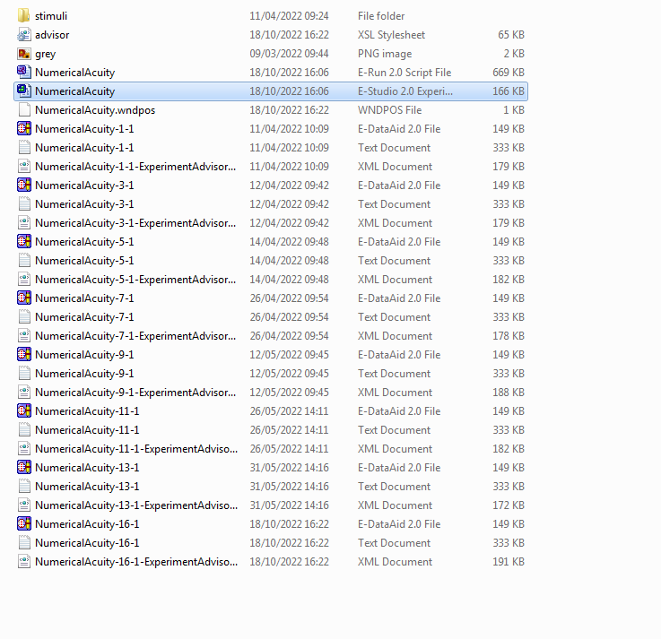
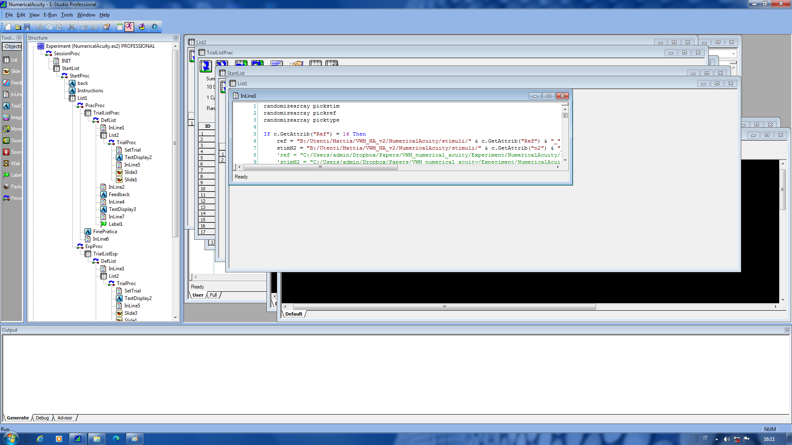

# VWM/NA - Visual working memory/Numerical acuity
Note that the experiment is called 'VWM_NA2' 
Experiment folder: C:\\Vision\\Mattia\\VWM_NA2

{width=80%}

Custom electrodes

- 5   -> HEOG_left

- 7   -> VEOG_down

- 27 -> HEOG_right

- 29 -> ear_right

- 10 -> 14 (yellow)

- 21 -> 18 (yellow)

- Ref -> ear_left

- Gnd -> 3 yellow

## Run the experiment
To run the experiment (from the participant's computer) we use ePrime.
In this project participants perform two different experiment, the first is before the EEG montage.
You can find it in the Desktop, then Mattia, VWM_NA_v2, NA

The second experiment is in the Desktop, then Mattia, VWM_NA_v2, VWM 

The file the you have to open is the one with the icon with three green squares, as in the example here below.

Once you are in ePrime, you run the experiment by clicking the icon with the running man (not the running man with the yellow arroow), as in the example.

Now ePrime will ask the participant number. It is really important to set the correct number. You can check this information in the computer near the recording computer (cannot say more information now, it is hard to describe a computer :-) ). This information is in Desktop -> Mattia -> VWM -> Partecipanti.
Now ePrime will ask you the session number, you can leave it as number 1. Finally, ePrime will ask you to confirm these last information (participant number and session number).

If for some reason you want to quit the experiment before the end, you can press together the left ctrl and the left alt keys, and press the left shift key (while keeping pressed ctrl and alt).

## --
In a [recent paper](Feldmann-Wustefeld-Psychphys-2020.pdf) a new experimental design to investigate visual working memory with EEG has been proposed. In past, in all the experimental design about visual working memory the participants were asked to maintain in memory a variable numer of items (e.g., colored squares) presented on the left or on the right of fixation. In this new proposal participants are asked to memorize both the left and the right side of the memory array. Importantly, the author proposed that participants encoded information preferably from the hemifield with a smaller number of items.
In our study
